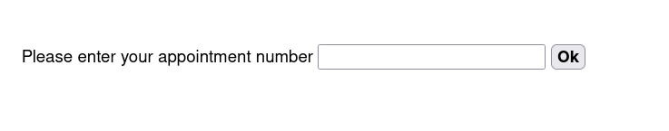
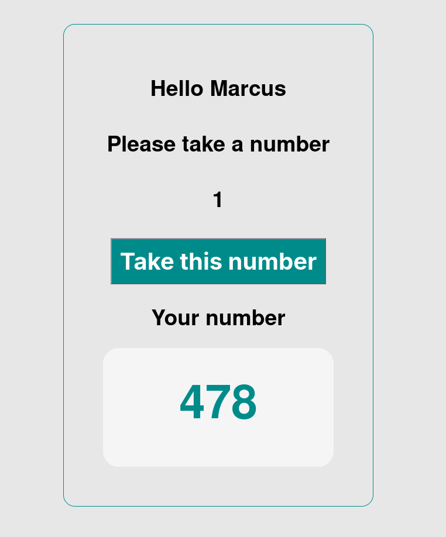
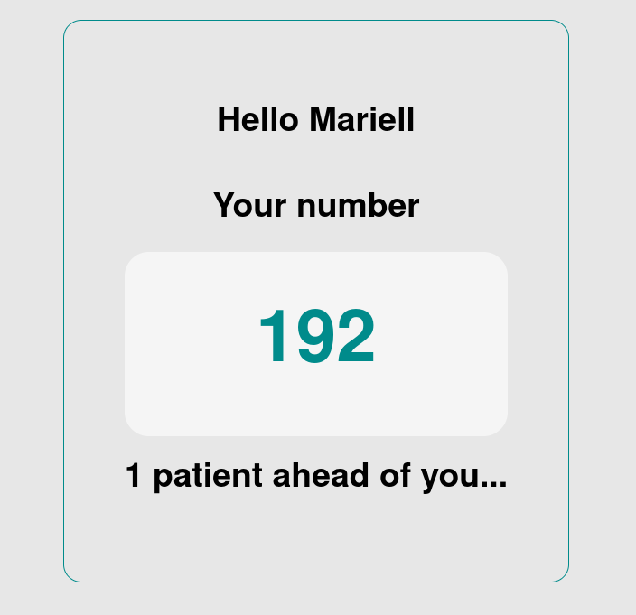
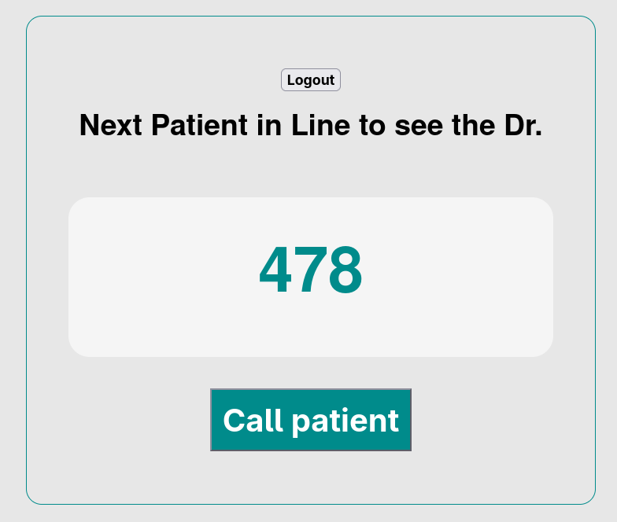
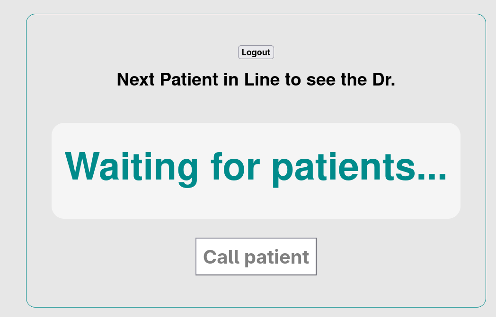

# Project

This application is developed around the idea of a ticket system for **Patients** and a **Receptionist/s**.

A patient should have an appointment number with them, this is usually sent to them in as SMS once they book an appointment with the doctor.

Once they enter their appointment number in the main page `http://localhost:8000/`, they are taken to the queue system.

They take a ticket, and wait in the line.

A receptionist needs to log in to the system through `http://localhost:8000/receptionist`.

Once logged in they can see the number of the patients waiting in line, they simply refer to the ticket number and nothing else, no patient name, or other details.

This project was part of an assignment from [Noroff backend second year](https://github.com/noroff-backend-2) and here is extended with some extra features.

Here I delved deeper into using [Keycloack](https://www.keycloak.org/) for auth and implemented a basic SQLite database configuration with sequelize.

# Installation

**Prerequisites**

- Node 22.x.x
- NPM version 10.x.x

# Configuration

1. Clone the project with `git clone https://github.com/yosang/doctors-appointment`
2. While on the root folder, do `npm install` to install all dependencies needed for this project.
3. Add `.env` file to each individual service.

# Usage

1. `npm run start` - Starts the application.
2. Visit the patients page at http://localhost:8000/
3. Visit the receptionist page at http://localhost:8000/receptionist

# Environment Variables

```sql
PORT=8000 -- // The main server port
WS_PORT=8001 -- The websocket port
KC_TEST_USER="" -- A test user for the receptionist to log in with
KC_TEST_USER_PW="" -- Password for the receptionist
KC_REALM="" -- Keycloak realm
KC_ADMIN_USERNAME="" -- Admin username for keycloak-admin
KC_ADMIN_PASSWORD="" -- Admin username for keycloak-admin
KC_CLIENT_ID="" -- Keycloak client id used during configuration of keycloak
```

# Dummy data

Upon first run of the application, some dummy data is created for testing.

## Receptionist user:

```sql
username: julia
password: john1234
```

## Patient apppointment:

```sql
appointmentNumber: 1234
appointmentNumber: 2222
appointmentNumber: 3243
```

# Screenshots

## Patients have to enter their appointment number



## Patients are asked to take a ticket number, their position in the queue is also shown



## Patients wait in line until their number is called, they can see how many patients are ahead



## Receptionists see the next patient in the queue once logged in



## If there is no patient waiting in line, this is also visualised



# Author

[Yosmel Chiang](https://github.com/yosang)
